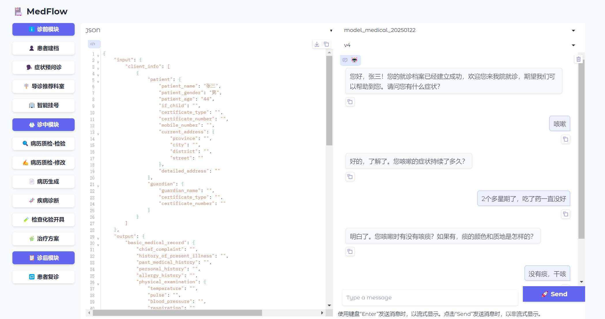

<div align="center">
<h1>
青囊慧诊全流程AI医疗框架<br>
<a>（Qingnang Smart Diagnosis - MedFlow All - Process Medical Framework）</a>
</h1>

</div>

<div align="center">

    
  <a href="code_license">
    
  </a>
  <a href="model_license">
    
  </a>
  
 | [English](README.md) | [中文](README_CN.md) |
 
</div>


##  0. Latest News 🎉🎉

* [2025-03-28] 发布青囊慧诊全流程AI医疗框架


##  1. Introduction


青囊慧诊是一款具备**落地级应用能力**的**全流程AI医疗框架**，旨在为医疗行业提供高效、智能的解决方案。本框架通过集成先进的大语言模型技术，已实现智能问诊、患者挂号、建立病历、诊断、开具检查单、处方、制定治疗方案等一系列核心功能。我们致力于提升医疗服务效率，改善患者就医体验，推动医疗行业智能化发展。

本框架以易用性和适应性为核心，可通过API 无缝接入DeepSeek、Qwen、Llama、Baichuan等大语言模型。无论是云端还是本地，均可通过本框架快速构建**智能化、以医疗业务为中心**的服务体系。

**核心特性**
+ 全流程接口：支持诊前、诊中、诊后多个环节的http服务接口
+ 灵活数据集成：支持自定义药品、疾病名等用户特有数据库接入，LLM + 检索来增强落地性
+ 高兼容性部署：支持直接使用OpenAI 服务接入各种模型
+ 多场景适配：覆盖医院、互联网医疗、医药流通等多种应用场景
+ 多角色支持：功能点全面，支持医、患、管三方技能，能为医院、医生、患者带来便利

**技术优势**
+ 精心调优过的Prompt指令和推理业务编排
+ 提供大模型意图识别、意图回退、SQL分发接口、多路召回等技术配合的落地解决方案
+ 效果先行，提供的意图、检索、数据库等技术示例，含有应用技巧且非常轻量级，便于二次开发和升级
+ 自带经过微调、增强训练后的医疗领域专用模型
+ 可视化业务试用界面（非技术人员友好）


##  2. Model Details

**2.1  模型下载**

大语言模型均可通过标准openai服务接入，我们实际测试过兼容的模型有：
**Deepseek v3、Deepseek R1、Qwen2.5、Llama 3.1、Baichuan4、QwQ等**，其中Deepseek R1、QwQ等强思考的推理模型需更改格式解析部分。

我们微调和增强训练后的医疗大语言模型，以及语音交互类的中文ASR、粤语ASR、TTS模型，链接如下：

|    模型     | 基座模型  |   模型格式   |         下载链接         |
| :----------: | :------: | :-------: |:---------------------------: |
| Qingnang-72B |    Qwen2.5-72B-Instruct    |    HuggingFace    | [ModelScope](https://modelscope.cn/models/MedFlow/Qingnang-72B) 
| Qingnang-9B |    GLM4-9B-Instruct    |    HuggingFace    | [ModelScope](https://modelscope.cn/models/MedFlow/Qingnang-9B) 
| Qingnang-ASR |    Whisper V3    |    HuggingFace    | [ModelScope](https://www.modelscope.cn/models/MedFlow/Qingnang-ASR)
| Qingnang-TTS |    GPT-Sovits2    |    HuggingFace    | [ModelScope](https://www.modelscope.cn/models/MedFlow/Qingnang-TTS)


我们微调和增强训练后的Qingnang医疗大语言模型在【医学专业能力】及【对话交互能力】均有所提升。采用MedBench权威医疗评测基准，医疗专业能力比训练前提高1.27%~80.17%；采用临床数据形成对话评测集，对话交互能力比训练前提高0.95%~85.65%，指标详情参见docs/Comparison_result.md，技术报告见docs/Qingnang.pdf。


##  3. Main Features


**主要功能** 🏆


本框架在**对话交互**与**临床推断**两种核心功能模块中表现出卓越效果，能为医院、医生、患者均带来便利：
+  **智能对话系统**：实现精准自然的AI医患交互对话能力，支持与患者对话完成建档、预问诊、随访等；支持与医生对话完成病历生成、质检修订等。
+  **临床推理引擎**：提供诊断、用药建议、检查单开具等核心推理功能，关键环节均达到95%以上的准确率。

**功能模块列表**

标星（⭐️）模块将逐步开放，如您有在医院落地的需求，推荐联系合作厂商【天锐医健】，联系方式见文档尾部。

|   功能     |  环节  | 类型  |  使用者  |
| :----------: |:---------------: |:---------------: |:---------------: |
| 患者建档  | 诊前 |对话交互 |  患者、医院  |
| 智能挂号  | 诊前  |对话交互 |  患者、医院  |
| 症状预问诊  | 诊前  |对话交互 |  患者、医生  |
| 导诊科室推荐  | 诊前  |对话交互 |  患者、医院  |
| 病历质检⭐️  | 诊中  |对话交互、临床推断 |  医生、医院 |
| 病历生成⭐️  | 诊中  |对话交互|  医生  |
| 病历生成-专科⭐️  | 诊中  |对话交互、临床推断 |  医生  |
| 疾病诊断⭐️  | 诊中  |临床推断 |  医生  |
| 药品建议⭐️ | 诊中  |临床推断 |  医生  |
| 检查开具⭐️ | 诊中  |临床推断 |  医生  |
| 处方生成⭐️ | 诊中  |对话交互、临床推断 |  医生  |
| 治疗方案⭐️  | 诊中  |对话交互、临床推断 |  医生  |
| 随访管理⭐️  | 诊后  |对话交互 |  患者、医院  |


##  4. Quick Start


**4.1  环境配置**

我们建议使用的docker/conda环境如下：
+ Ubuntu20.04、python3.12
+ NVIDIA-SMI 535.154.05、Driver Version: 535.154.05、CUDA Version: 12.2

您可以使用满足条件的自己的环境，也可以通过下面命令启动容器：

```bash
docker pull nvcr.io/nvidia/cuda:12.2.0-devel-ubuntu20.04
sudo docker run -itd --name <container_name> -v /home/<username>:/home/workspace --gpus all --ipc=host -v /root/.ssh:/root/.ssh --cap-add=SYS_PTRACE --privileged=true --ulimit stack=68719476736 --network host --shm-size=20G nvcr.io/nvidia/cuda:12.2.0-devel-ubuntu20.04 /bin/bash
```

**代码下载**

```bash
git clone -b develop https://github.com/MedFlow2025/medflow.git
```

**依赖安装**

请确认您的python版本，然后执行：

```bash
pip install -r requirements.txt
```

**4.2  服务运行**


**openai服务准备**

您需要事先用[ollama](https://ollama.com/)、[fastchat](https://github.com/lm-sys/FastChat)、[vllm](https://vllm.hyper.ai/docs/)等部署好模型。我们也将陆续开放一些部署文档供参考，见[部署文档](./docs)。

部署后您将有类似如下URL的openai的服务:

```bash
http://<openai ip>:<openai port>/v1 
```

**数据准备（可选）**

我们提供了自定义知识库导入功能，包括诊断、药品、检查单等，具体示例请参考[data](./data)目录，使用方法可以参考[数据准备说明文档](./docs/data_preparation.md)，可运行如下脚本。

```bash
python3 create_database.py
```

我们提供了自定义质检规则的功能，具体示例请参考 quality/quality.json 文件，修改重启即可生效。

**服务启动**

```bash
python3 inference.py --model <model_name> --model-url http://<openai ip>:<port>/v1 --fastbm25 --log --host <server ip> --port <server port> --max-round 30 --database ../data/processed/database
```

**webui界面启动**

```bash
python3 inference_gradio.py --host <server ip> --port <server port> --gradio-port <webui port> --model <model_name>
```

**4.3  功能体验**


**请求测试**

我们提供了用于curl请求的测试文档和[测试脚本](./tests)的脚本，具体使用方法可以参考[curl请求说明文档](./docs/tests.md)。

```bash
cd ./tests

#对话生成患者建档
bash test-clientinfo.sh

#对话生成导诊
bash test-hospitalguide.sh

#对话生成预问诊报告
bash test-basicmedicalrecord.sh

#对话生成挂号
bash test-register.sh

#生成诊断
bash test-diagnosis.sh

#生成检查和化验
bash test-examineassay.sh

#生成治疗方案
bash test-therapyscheme.sh

#对话生成复诊
bash test-returnvisit.sh

#生成病历
bash test-doctormedicalrecord.sh
```

**界面体验**

可打开webui界面启动后的提示网址，体验各模块的功能：
```bash
http://<webui ip>:<webui port>
```
<div align="center">
  
</div>

##  5. Statement of Agreement

+ 使用本框架代码及模型需遵循 [Apache 2.0](https://github.com/MedFlow2025/medflow/blob/master/LICENSE) [开源协议](./LICENSE)，支持商用，不需要申请授权，请您了解并遵循，勿将开源模型和代码及基于开源项目产生的衍生物用于任何可能给国家和社会带来危害的用途以及用于任何未经过安全评估和备案的服务。

+ 尽管模型在训练时我们已采取措施尽力确保数据的合规性和准确性，但模型参数量巨大且受概率随机性因素影响，我们无法保证输出内容的准确性，且模型易被输入指令所误导，本项目不承担开源模型和代码导致的数据安全、舆情风险或发生任何模型被误导、滥用、传播、不当利用而产生的风险和责任。**您将对通过使用、复制、分发和修改模型等方式利用该开源项目所产生的风险与后果，独自承担全部责任。**


##  6. Contact Information


+ 本框架已经在多家三甲医院实地应用部署。  🚀
+ 如果您在使用过程中遇到问题或有任何建议，欢迎通过**本项目的 GitHub  Issues页面**提交问题，我们将及时回复处理。
+ 如果您想做医疗或其他领域的数据处理、日常训练、增强训练等，建议使用EPAI平台！
+ 如有在医院私有化部署的需求，HIS相关的定制需求，推荐经验丰富的医疗合作伙伴**HIS厂商**：**[广州天锐医健信息科技有限公司](https://www.skytek.com.cn/)**，欢迎联系！
<div align="center">
  
</div>

+ 我们期待通过医疗大模型推理部署服务为医疗行业带来新变革，为患者和医护人员提供更优质的服务。诚邀您的参与和支持！
